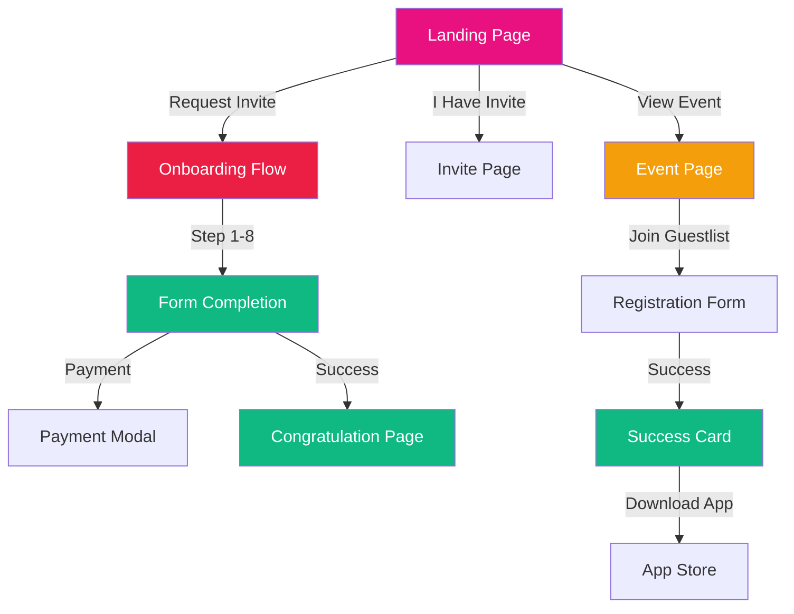
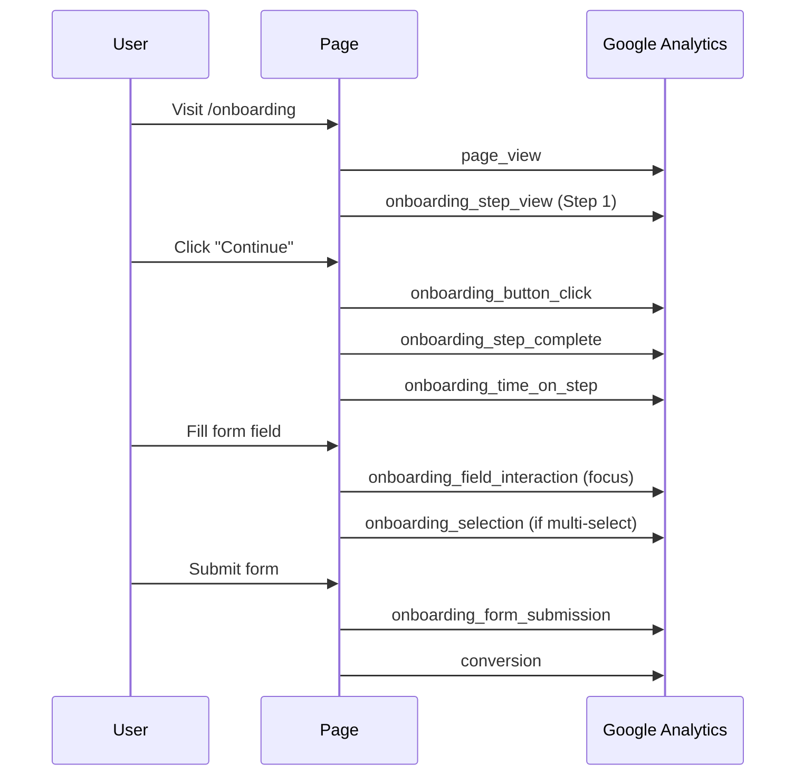
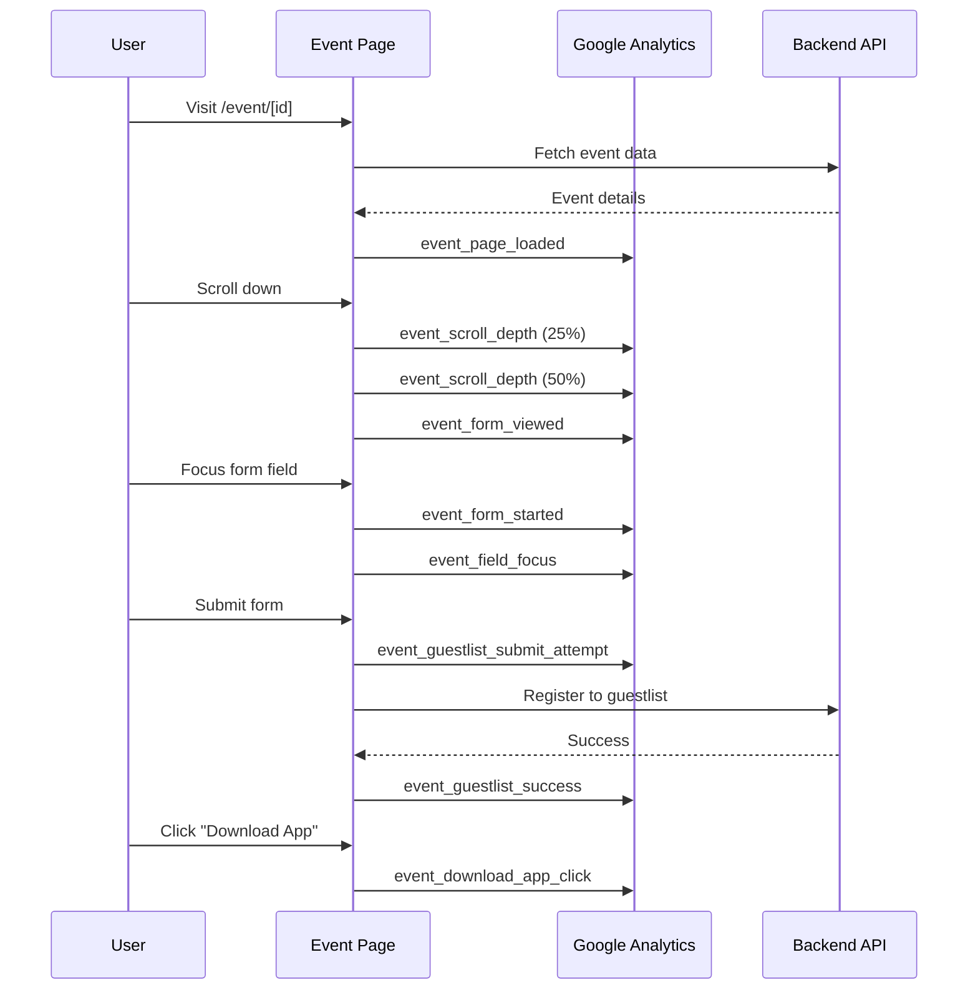
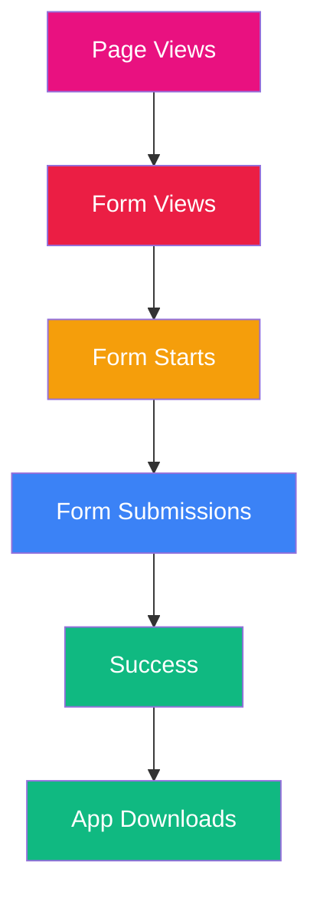

# 📊 Google Analytics Events - Complete Guide

> **Comprehensive documentation of all tracking events across the PuraVida website**

This guide provides a complete overview of all Google Analytics 4 events tracked on the website, organized by user journey and page type.

---

## 📈 Overview

The website tracks **50+ unique events** across multiple user journeys:

- 🏠 **Landing Page** - 10+ events
- 📝 **Onboarding Flow** - 20+ events
- 🎫 **Event Pages** - 27+ events
- 📞 **Contact & Navigation** - 5+ events
- ✅ **Conversions** - 3+ events

All events automatically include:

- ✅ UTM parameters (if present)
- ✅ Attribution data
- ✅ Timestamp
- ✅ Page context

---

## 🗺️ User Journey Flow



---

## 🏠 Landing Page Events

### Page View

**Event:** `page_view`  
**Trigger:** Automatic on page load and route changes  
**Parameters:**

```json
{
  "page_path": "/",
  "page_title": "PuraVida - Dubai's Exclusive Inner Circle",
  "page_location": "https://puravida.com/",
  "utm_source": "...",
  "utm_medium": "...",
  "utm_campaign": "..."
}
```

### Button Clicks

**Event:** `onboarding_button_click`  
**Locations:**

- Header: Logo, "Check Eligibility" CTA
- Navigation: What is PuraVida, How it works, Benefits, Memberships
- Hero: "I have an invite", "Request an invite"
- Sections: "Get Started Now" (How it works)
- Footer: Privacy Policy, Terms, Cookie Policy, Contact Us

**Parameters:**

```json
{
  "button_name": "Check Eligibility",
  "step_number": 0,
  "location": "header-cta"
}
```

---

## 📝 Onboarding Flow Events

### Journey Overview

```mermaid
flowchart LR
    A[Step 1: Hero] --> B[Step 2: Personal Info]
    B --> C[Step 3: Music Taste]
    C --> D[Step 4: Favorite DJ]
    D --> E[Step 5: Places Dubai]
    E --> F[Step 6: Festivals Been]
    F --> G[Step 7: Festivals Want]
    G --> H[Step 8: Nightlife Frequency]
    H --> K[Step 11: Confirmation]
    K --> L[Step 12: Payment]

    style A fill:#E91180,color:#fff
    style K fill:#10b981,color:#fff
    style L fill:#f59e0b,color:#fff
```



### Step Tracking Events

#### 1. Step View

**Event:** `onboarding_step_view`  
**Trigger:** When user enters a step  
**Parameters:**

```json
{
  "step_number": 2,
  "step_name": "Personal Information",
  "progress_percentage": 22
}
```

#### 2. Step Complete

**Event:** `onboarding_step_complete`  
**Trigger:** When user moves to next step  
**Parameters:**

```json
{
  "step_number": 2,
  "step_name": "Personal Information",
  "time_spent_seconds": 45,
  "progress_percentage": 22
}
```

#### 3. Time on Step

**Event:** `onboarding_time_on_step`  
**Trigger:** When leaving a step  
**Parameters:**

```json
{
  "step_number": 2,
  "step_name": "Personal Information",
  "time_spent_seconds": 45
}
```

### Form Interaction Events

#### 4. Field Interaction

**Event:** `onboarding_field_interaction`  
**Trigger:** Focus, blur, or change on form fields  
**Parameters:**

```json
{
  "field_name": "fullName",
  "step_number": 2,
  "action": "focus" | "blur" | "change"
}
```

#### 5. Selection (Multi-select)

**Event:** `onboarding_selection`  
**Trigger:** Selecting/deselecting options (music genres, places)  
**Parameters:**

```json
{
  "field_name": "musicTaste",
  "value": "House",
  "step_number": 3,
  "is_selected": true
}
```

#### 6. Validation Error

**Event:** `onboarding_validation_error`  
**Trigger:** Form validation fails  
**Parameters:**

```json
{
  "step_number": 2,
  "field_name": "email",
  "error_type": "invalid_email"
}
```

#### 7. Scroll Depth

**Event:** `onboarding_scroll_depth`  
**Trigger:** User scrolls 25%, 50%, 75%, or 100%  
**Parameters:**

```json
{
  "step_number": 2,
  "scroll_depth": 50
}
```

### Submission Events

#### 8. Form Submission

**Event:** `onboarding_form_submission`  
**Trigger:** Final form submission  
**Parameters:**

```json
{
  "success": true,
  "time_to_complete_seconds": 420,
  "form_data": {
    "has_music_taste": true,
    "has_favorite_dj": true,
    "has_favorite_places": true,
    "has_festivals": true,
    "music_genres_count": 3,
    "places_count": 2
  }
}
```

#### 9. Drop-off

**Event:** `onboarding_drop_off`  
**Trigger:** User leaves before completing  
**Parameters:**

```json
{
  "step_number": 5,
  "step_name": "Favorite Places",
  "progress_percentage": 55
}
```

### Button Clicks

**Event:** `onboarding_button_click`  
**Common Buttons:**

- "Hero CTA" (Step 1)
- "Continue" (All steps)
- "Back" (Navigation)
- "Download iOS App" (Step 11)
- "Download Android App" (Step 11)
- "Contact Email" (Step 11)
- "Contact WhatsApp" (Step 11)

**Parameters:**

```json
{
  "button_name": "Continue",
  "step_number": 2,
  "location": "form-submit"
}
```

### Conversion Event

**Event:** `conversion`  
**Trigger:** Final form completion  
**Parameters:**

```json
{
  "event_category": "Onboarding",
  "event_label": "Form Completed",
  "value": 1,
  "time_to_complete_seconds": 420,
  "form_completeness": 100
}
```

---

## 🎫 Event Page Events

### Page Load Events

#### 1. Page Loaded

**Event:** `event_page_loaded`  
**Trigger:** Event page successfully loads  
**Parameters:**

```json
{
  "event_id": "a07eec3c-c9a6-4af7-b34f-8fe82ea8a0f0",
  "event_name": "FRIDAYS AT REUNION",
  "venue_name": "Reunion DXB",
  "venue_id": "9e68147d-0b20-477e-85c1-31c6a0232989",
  "artist_name": "BAKH,ABLA",
  "event_date": "2025-12-05 23:00:00",
  "is_guestlist_open": true,
  "is_guestlist_full": false,
  "guestlist_capacity": 100,
  "guestlist_current_count": 25,
  "capacity_percentage": 25,
  "has_video_banner": true,
  "load_time_ms": 234
}
```

#### 2. Page Error

**Event:** `event_page_error`  
**Trigger:** Failed to load event  
**Parameters:**

```json
{
  "event_id": "a07eec3c-...",
  "error_type": "event_not_found" | "network_error",
  "error_message": "Event not found",
  "load_time_ms": 5000
}
```

### Engagement Events

#### 3. Form Viewed

**Event:** `event_form_viewed`  
**Trigger:** Registration form enters viewport  
**Parameters:**

```json
{
  "event_id": "a07eec3c-...",
  "event_name": "FRIDAYS AT REUNION",
  "time_to_view_seconds": 12
}
```

#### 4. Scroll Depth

**Event:** `event_scroll_depth`  
**Trigger:** User scrolls 25%, 50%, 75%, or 100%  
**Parameters:**

```json
{
  "event_id": "a07eec3c-...",
  "depth": 25 | 50 | 75 | 100
}
```

#### 5. Time on Page

**Event:** `event_time_on_page`  
**Trigger:** User leaves page (beforeunload)  
**Parameters:**

```json
{
  "event_id": "a07eec3c-...",
  "time_seconds": 180,
  "form_submitted": false,
  "form_started": true
}
```

### Form Interaction Events

#### 6. Form Started

**Event:** `event_form_started`  
**Trigger:** First field interaction  
**Parameters:**

```json
{
  "event_id": "a07eec3c-...",
  "event_name": "FRIDAYS AT REUNION",
  "first_field": "firstName"
}
```

#### 7. Field Focus

**Event:** `event_field_focus`  
**Trigger:** User focuses on form field  
**Parameters:**

```json
{
  "event_id": "a07eec3c-...",
  "field": "firstName"
}
```

#### 8. Field Blur

**Event:** `event_field_blur`  
**Trigger:** User leaves form field  
**Parameters:**

```json
{
  "event_id": "a07eec3c-...",
  "field": "firstName"
}
```

#### 9. Country Code Changed

**Event:** `event_country_code_changed`  
**Trigger:** User changes phone country code  
**Parameters:**

```json
{
  "event_id": "a07eec3c-...",
  "old_code": "971",
  "new_code": "1"
}
```

### Validation Events

#### 10. Validation Error

**Event:** `event_validation_error`  
**Trigger:** Form validation fails  
**Parameters:**

```json
{
  "event_id": "a07eec3c-...",
  "event_name": "FRIDAYS AT REUNION",
  "field": "first_name" | "last_name" | "phone",
  "error_type": "missing_first_name" | "missing_last_name" | "missing_phone" | "invalid_phone",
  "time_to_error_seconds": 15,
  "phone_length": 8
}
```

### Submission Events

#### 11. Submit Button Click

**Event:** `event_submit_button_click`  
**Trigger:** User clicks "Join Guest List" button  
**Parameters:**

```json
{
  "event_id": "a07eec3c-...",
  "event_name": "FRIDAYS AT REUNION"
}
```

#### 12. Guestlist Submit Attempt

**Event:** `event_guestlist_submit_attempt`  
**Trigger:** Form submission initiated  
**Parameters:**

```json
{
  "event_id": "a07eec3c-...",
  "event_name": "FRIDAYS AT REUNION",
  "venue_name": "Reunion DXB",
  "time_to_submit_seconds": 45,
  "country_code": "971"
}
```

#### 13. Guestlist Success

**Event:** `event_guestlist_success`  
**Trigger:** Successful registration  
**Parameters:**

```json
{
  "event_id": "a07eec3c-...",
  "event_name": "FRIDAYS AT REUNION",
  "venue_name": "Reunion DXB",
  "artist_name": "BAKH,ABLA",
  "already_registered": false,
  "time_to_complete_seconds": 45,
  "api_response_time_ms": 234,
  "has_activation_code": true,
  "country_code": "971"
}
```

### Error Events

#### 14. Guestlist Closed Attempt

**Event:** `event_guestlist_closed_attempt`  
**Trigger:** User tries to register when guestlist is closed  
**Parameters:**

```json
{
  "event_id": "a07eec3c-...",
  "event_name": "FRIDAYS AT REUNION"
}
```

#### 15. Guestlist Full Attempt

**Event:** `event_guestlist_full_attempt`  
**Trigger:** User tries to register when guestlist is full  
**Parameters:**

```json
{
  "event_id": "a07eec3c-...",
  "event_name": "FRIDAYS AT REUNION",
  "capacity": 100,
  "current_count": 100
}
```

#### 16. API Error

**Event:** `event_guestlist_api_error`  
**Trigger:** API returns error  
**Parameters:**

```json
{
  "event_id": "a07eec3c-...",
  "event_name": "FRIDAYS AT REUNION",
  "error_message": "Failed to register",
  "api_response_time_ms": 5000,
  "country_code": "971"
}
```

#### 17. Network Error

**Event:** `event_guestlist_network_error`  
**Trigger:** Network request fails  
**Parameters:**

```json
{
  "event_id": "a07eec3c-...",
  "event_name": "FRIDAYS AT REUNION",
  "error_message": "Network error",
  "country_code": "971"
}
```

### Success Actions

#### 18. Activation Code Copied

**Event:** `event_activation_code_copied`  
**Trigger:** User copies activation code  
**Parameters:**

```json
{
  "event_id": "a07eec3c-...",
  "event_name": "FRIDAYS AT REUNION"
}
```

#### 19. Activation Code Missing

**Event:** `event_activation_code_missing`  
**Trigger:** Registration succeeds but no activation code  
**Parameters:**

```json
{
  "event_id": "a07eec3c-..."
}
```

#### 20. Download App Click

**Event:** `event_download_app_click`  
**Trigger:** User clicks download app button  
**Parameters:**

```json
{
  "event_id": "a07eec3c-...",
  "event_name": "FRIDAYS AT REUNION",
  "from_state": "new_registration" | "already_registered"
}
```

### Navigation Events

#### 21. Scroll to Form

**Event:** `event_scroll_to_form`  
**Trigger:** User clicks sticky "Join Guest List" button  
**Parameters:**

```json
{
  "event_id": "a07eec3c-...",
  "event_name": "FRIDAYS AT REUNION"
}
```

### Media Events

#### 22. Video Played

**Event:** `event_video_played`  
**Trigger:** Event video starts playing  
**Parameters:**

```json
{
  "event_id": "a07eec3c-...",
  "event_name": "FRIDAYS AT REUNION"
}
```

#### 23. Video Error

**Event:** `event_video_error`  
**Trigger:** Video fails to load/play  
**Parameters:**

```json
{
  "event_id": "a07eec3c-...",
  "event_name": "FRIDAYS AT REUNION",
  "error_type": "load_error" | "play_error"
}
```

#### 24. Image Error

**Event:** `event_image_error`  
**Trigger:** Event image fails to load  
**Parameters:**

```json
{
  "event_id": "a07eec3c-...",
  "event_name": "FRIDAYS AT REUNION"
}
```

### Error Page Events

#### 25. Error Page Displayed

**Event:** `event_error_page_displayed`  
**Trigger:** Error page is shown  
**Parameters:**

```json
{
  "event_id": "a07eec3c-...",
  "error_type": "event_not_found" | "network_error"
}
```

#### 26. Error Go Home Click

**Event:** `event_error_go_home_click`  
**Trigger:** User clicks "Go Home" on error page  
**Parameters:**

```json
{
  "event_id": "a07eec3c-...",
  "error_type": "event_not_found" | "network_error"
}
```

---

## 📞 Contact & Navigation Events

### Contact Modal

**Event:** `contact_method_selected`  
**Trigger:** User selects contact method  
**Parameters:**

```json
{
  "method": "email" | "whatsapp",
  "contact_type": "footer_modal"
}
```

### Button Clicks

**Event:** `onboarding_button_click`  
**Locations:**

- Header: Logo
- Footer: Privacy Policy, Terms of Service, Cookie Policy, Contact Us

---

## ✅ Conversion Events

### 1. Onboarding Conversion

**Event:** `conversion`  
**Trigger:** User completes onboarding form  
**Parameters:**

```json
{
  "event_category": "Onboarding",
  "event_label": "Form Completed",
  "value": 1,
  "time_to_complete_seconds": 420,
  "form_completeness": 100
}
```

### 2. Share Success

**Event:** `conversion`  
**Trigger:** User successfully shares invite  
**Parameters:**

```json
{
  "action": "share_success"
}
```

---

## 📊 Event Flow Diagrams

### Onboarding Flow



### Event Page Flow



---

## 🎯 Key Metrics You Can Track

### Conversion Funnel



### Metrics Available

| Metric                   | Event                                             | Calculation                        |
| ------------------------ | ------------------------------------------------- | ---------------------------------- |
| **Conversion Rate**      | `conversion` / `page_view`                        | % who complete onboarding          |
| **Form Start Rate**      | `event_form_started` / `event_page_loaded`        | % who begin registration           |
| **Form Completion Rate** | `event_guestlist_success` / `event_form_started`  | % who finish registration          |
| **Time to Convert**      | `time_to_complete_seconds`                        | Average time from start to success |
| **Error Rate**           | `event_validation_error` / `event_form_started`   | % of form errors                   |
| **Drop-off Rate**        | `onboarding_drop_off` / `onboarding_step_view`    | % who leave mid-flow               |
| **Scroll Engagement**    | `event_scroll_depth` (100%) / `event_page_loaded` | % who scroll to bottom             |

---

## 📋 Event Categories

### 🟢 Engagement Events

- `page_view`
- `event_scroll_depth`
- `event_time_on_page`
- `onboarding_scroll_depth`

### 🔵 Interaction Events

- `onboarding_button_click`
- `onboarding_field_interaction`
- `onboarding_selection`
- `event_field_focus`
- `event_field_blur`
- `event_country_code_changed`

### 🟡 Progress Events

- `onboarding_step_view`
- `onboarding_step_complete`
- `onboarding_time_on_step`
- `event_form_viewed`
- `event_form_started`

### 🔴 Error Events

- `event_page_error`
- `onboarding_validation_error`
- `event_validation_error`
- `event_guestlist_api_error`
- `event_guestlist_network_error`
- `event_guestlist_closed_attempt`
- `event_guestlist_full_attempt`
- `event_video_error`
- `event_image_error`
- `event_activation_code_missing`

### 🟢 Success Events

- `event_guestlist_success`
- `event_activation_code_copied`
- `onboarding_form_submission`
- `conversion`

### 🟣 Navigation Events

- `event_scroll_to_form`
- `event_download_app_click`
- `contact_method_selected`

---

## 🔍 Event Parameters Reference

### Common Parameters (All Events)

All events automatically include:

```json
{
  "timestamp": "2025-01-15T10:30:00.000Z",
  "utm_source": "google",
  "utm_medium": "cpc",
  "utm_campaign": "summer_2024",
  "utm_term": "dubai_nightlife",
  "utm_content": "ad_variant_a"
}
```

### Event-Specific Parameters

| Event                      | Unique Parameters                                                   |
| -------------------------- | ------------------------------------------------------------------- |
| `onboarding_step_view`     | `step_number`, `step_name`, `progress_percentage`                   |
| `onboarding_step_complete` | `time_spent_seconds`                                                |
| `onboarding_selection`     | `field_name`, `value`, `is_selected`                                |
| `event_page_loaded`        | `event_id`, `venue_name`, `artist_name`, `load_time_ms`             |
| `event_guestlist_success`  | `already_registered`, `api_response_time_ms`, `has_activation_code` |
| `conversion`               | `time_to_complete_seconds`, `form_completeness`                     |

---

## 📊 Google Analytics Reports

### Recommended Custom Reports

1. **Conversion Funnel**

   - `page_view` → `onboarding_step_view` → `onboarding_form_submission` → `conversion`

2. **Event Registration Funnel**

   - `event_page_loaded` → `event_form_viewed` → `event_form_started` → `event_guestlist_success`

3. **Drop-off Analysis**

   - Track `onboarding_drop_off` by `step_number` to identify problem steps

4. **Error Analysis**

   - Group all `*_error` events to identify common issues

5. **Time Analysis**
   - Average `time_to_complete_seconds` across different user segments

---

## 🛠️ Implementation Details

### Automatic Attribution

All events automatically include attribution data via `getAttribution()`:

```typescript
// Automatically added to every event
{
  utm_source: "...",
  utm_medium: "...",
  utm_campaign: "...",
  utm_term: "...",
  utm_content: "...",
  // Plus any custom attribution data
}
```

### Event Tracking Functions

Located in `lib/analytics.ts`:

- `trackPageView(path, title?)` - Page views
- `trackEvent(name, params?)` - Custom events
- `trackStepView(step, name)` - Step views
- `trackStepComplete(step, name, time)` - Step completion
- `trackButtonClick(name, step, location)` - Button clicks
- `trackFieldInteraction(field, step, action)` - Field interactions
- `trackFormSubmission(success, data, time)` - Form submissions
- `trackConversion(data, time)` - Conversions

---

## 📝 Notes

- All events are sent as **GA4 events** (not config calls)
- Events include **automatic attribution** (UTM parameters)
- **Timestamps** are included in all custom events
- **Page context** is preserved across navigation
- Events are **queued** if GA script hasn't loaded yet

---

## 🔗 Related Documentation

- [GA_BUILD_FIX.md](./GA_BUILD_FIX.md) - Fixing GA in production builds
- [lib/analytics.ts](./lib/analytics.ts) - Event tracking implementation
- [components/GoogleAnalytics.tsx](./components/GoogleAnalytics.tsx) - GA component

---

**Last Updated:** January 2025  
**Total Events Tracked:** 50+  
**Event Categories:** 6  
**Automatic Attribution:** ✅ Enabled
